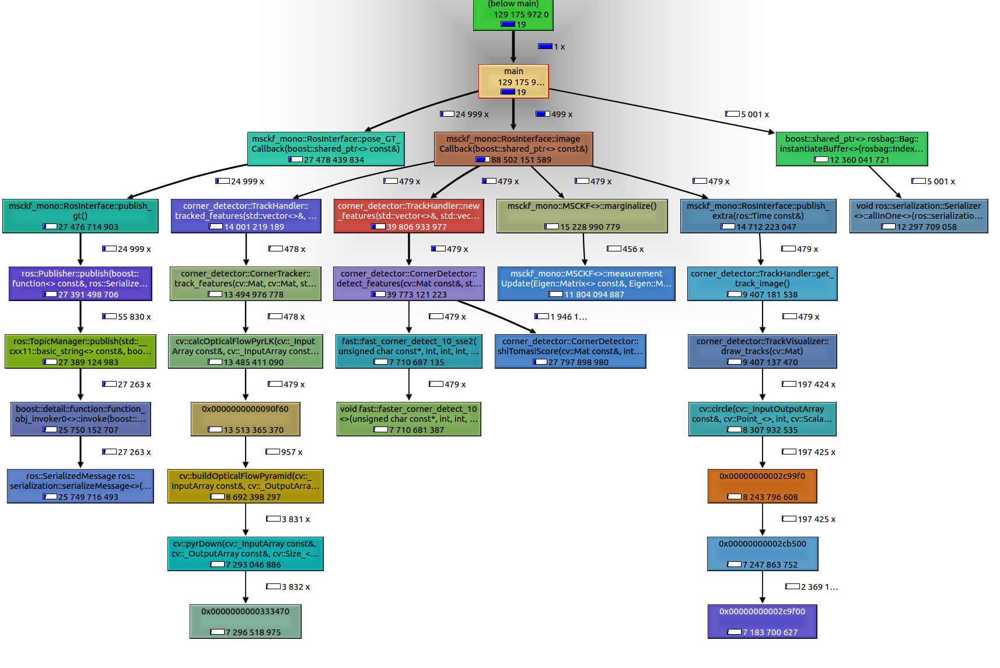
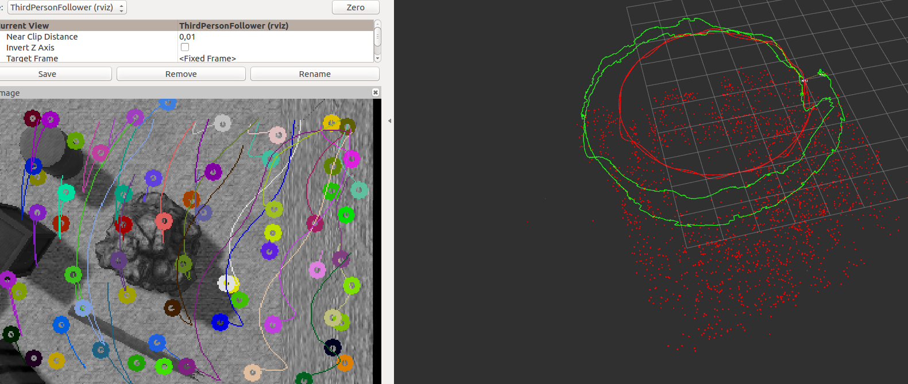
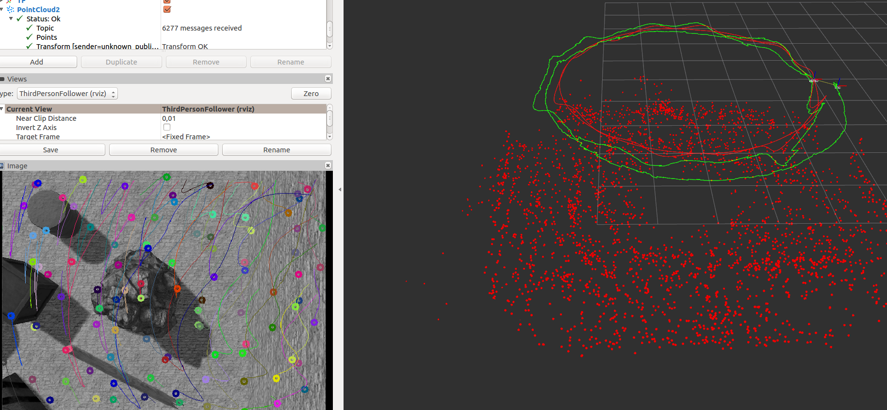
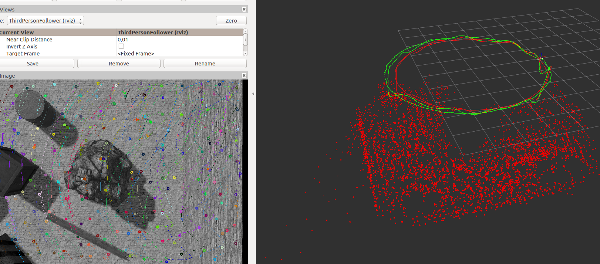

# msckf_mono - Profiling
A fork from [Monocular MSCKF with ROS Support](https://github.com/daniilidis-group/msckf_mono)

## Requirements/Building
- ROS Kinetic with Boost, OpenCV and Eigen
- https://github.com/uzh-rpg/fast build and install according to their instructions


### Local catkin workspace

E.g. create a local catkin workspace `profiling_ws` that looks like:
```
profiling_ws
├── dataset        
    └── AAU_VIO    "download from https://zenodo.org/record/3870851"
└── src
    ├── fast        "git clone https://github.com/uzh-rpg/fast"
    ├── msckf_mono  "git clone --branch profiling --recurse-submodules https://github.com/jungr-ait/msckf_mono.git"
    └── CMakeLists.txt -> /opt/ros/kinetic/share/catkin/cmake/toplevel.cmake (from "<>/src$ catkin_init_workspace")
```

Build the catkin workspace as [release with debug information](https://cmake.org/cmake/help/latest/variable/CMAKE_BUILD_TYPE.html) for profiling the binary.
```
profiling_ws$ catkin_make --cmake-args -DCMAKE_BUILD_TYPE=RELWITHDEBINFO -DCMAKE_CXX_FLAGS=-msse4.2

```
After a successful build a `main_demo_ros` binary should be located in
```
profiling_ws
└── devel
    ├── lib        
        └── main_demo_ros    "used for profiling the algorithm"
```

# Tutorial: PROFILING 

`main_demo_ros` allows a synchronous message by message processing of bag files and the parametrization of the
`ros_interface` via YAML file. This standalone executable supports various input arguments:
```
Usage: ./msckf_demo_ros [OPTIONS]

Options:
  -h,--help                   Print this help message and exit
  -b,--bagfile TEXT           bag file name to be processed
  --topic_imu TEXT            topic name
  --topic_camera TEXT         topic name
  --topic_gt_position TEXT    topic name
  --topic_gt_pose TEXT        topic name
  --start_sec FLOAT           start time
  --stop_sec FLOAT            stop time
  --num_loops INT             number of loops processed
  --rate_Hz INT               processing rate
  -c,--config_filename TEXT   configuration file
  --rate_reduction_imu INT    reduction factor for imu
  --rate_reduction_cam INT    reduction factor for cam
```     
to simplify the profiling.

In the following a instruction to profile the algorithm using the synthetic dataset is given.


## Profiling on the AAU synthetic ROS dataset for VIO

To profile the algorithm with different camera resolution and different sensor rates the `AAU synthetic ROS dataset for VIO` by Jung et al.
can be used and downloaded [here on Zenodo](https://zenodo.org/record/3870851)

In the folder `msckf_mono/profiling` a script is provided to profile the `MSCKF_mono` with [valgrind](valgrind.org) tool set using the first 1000 camera images at a rate of 10 Hz and the IMU at a rate of 100 Hz (refer to the reduction rates).

1. Run the `roscore` in a terminal
    ```
     profiling_ws$ roscore
    ```
2. Open `rviz` with a predefined configuration from a terminal:
    ```
    /msckf_mono/profiling$ rviz -d ../euroc/demo_ros.rviz
    ```
3. Run the scripts with the binary and the root directory of the dataset.
    ```
    <>/src/msckf_mono/profiling$ ./profile_msckf_demo_ros.sh <main_demo_ros binary> <root of dataset>
    ```

    E.g.:
    ```
    <>/src/msckf_mono/profiling$ ./profile_msckf_demo_ros.sh ../../../devel/lib/msckf_mono/msckf_demo_ros ../../../dataset/AAU_VIO
    ```
    
    This should result in an output similar to:
    ```
    <>/src/msckf_mono/profiling$ bash profile_msckf_demo_ros.sh ../../../devel/lib/msckf_mono/msckf_demo_ros /home/jungr/workspace/datasets/MCS_Run_15_Resolutions
    used EXEC: ../../../devel/lib/msckf_mono/msckf_demo_ros
    used DATASET_PATH: /home/jungr/workspace/datasets/MCS_Run_15_Resolutions
    profile SMALL...
    ==14340== Callgrind, a call-graph generating cache profiler
    ==14340== Copyright (C) 2002-2015, and GNU GPL'd, by Josef Weidendorfer et al.
    ==14340== Using Valgrind-3.11.0 and LibVEX; rerun with -h for copyright info
    ==14340== Command: ../../../devel/lib/msckf_mono/msckf_demo_ros --topic_imu /mus/imu --topic_camera /mus/image --topic_gt_pose /mus/ground_truth_pose_imu --rate_reduction_imu 5 --rate_reduction_cam 10 -b //home/jungr/workspace/datasets/MCS_Run_15_Resolutions/320_240/record.bag -c /home/jungr/workspace/catkin/profiling_ws/src/msckf_mono/profiling/../unitysim/unitysim_config_small.yaml --process_N_cam_imgs 1000
    ==14340==
    ==14340== For interactive control, run 'callgrind_control -h'.
    q_eig: (wxyz)[0.712301,-0.00770718,0.0104993,0.701753]
    q_cv_eig: (wxyz)[0.712301,-0.00770718,0.0104993,0.701753]
     should be:  0.7123 -0.0077 0.0105 0.7018 (wxyz)
    bagfile exists...;
    ==14340== brk segment overflow in thread #1: can't grow to 0x4a2a000
    ==14340== brk segment overflow in thread #1: can't grow to 0x4a32000
    Opening bag-file: //home/jungr/workspace/datasets/MCS_Run_15_Resolutions/320_240/record.bagrun bag-file 1 timesRosInterface.load_YAML_parameters() /home/jungr/workspace/catkin/profiling_ws/src/msckf_mono/profiling/../unitysim/unitysim_config_small.yaml
    CornerDetector::set_grid_size set8,6
    CornerDetector::detection_threshold_ set40
    [ INFO] [1609153576.905520550]: -  Intrinsics: 250, 250, 159.5, 119.5
    [ INFO] [1609153576.916820766]: -  Distortion: 0, 0, 0, 0
    [ INFO] [1609153576.924847505]: -  q_CI: 1,0,0,0 (xyzw)
    [ INFO] [1609153576.943516249]: -  p_C_I: 0 0 0
    [ INFO] [1609153576.945171647]: -  stand still duration: 1.95
    [ INFO] [1609153576.947611966]: -  Tracker config: 6,8,2e-06,40
    node configured....
    * Rosbag start time: 1565122155.848576546 [sec]
    * Rosbag stop time: 1565122227.848576546 [sec]
    * Playback start offset: 0
    
    ==14340== brk segment overflow in thread #1: can't grow to 0x4a3c000
    * Stand still is expected to be over at:  1.960000048 [sec]
    * processed [1%], bag time: 1565122156.568576574 [sec], relative: 0.72 [sec]
    * processed [2%], bag time: 1565122157.288576603 [sec], relative: 1.44 [sec]
    can initialize imu now at: 2
    number IMU readings for init: 199
    imu_init: imu is gravity aligned...
    simulation detected, setting ground-truth values...
    * using last pose_I_G (from G to I) for  init:
    2 [sec] - 0,0,0(xyz)/-0,0,-0,1(xyzw)
    [ INFO] [1609153578.230915151]:
    Initial IMU State
    --p_I_G 0 0 0
    --q_IG 1,-0,0,-0
    --v_I_G 0 0 0
    --b_a 0 0 0
    --b_g 0 0 0
    --g     0     0 -9.81
    
    IMU initalized and MSCKF setup...
    * processed [3%], bag time: 1565122158.8576632 [sec], relative: 2.16 [sec]
    .... (be patient!)
    ```
1. Be patient, this may take couple of hours!
1. Run `kcachegrind` to get the reports
    ```commandline
    $ kcachegrind <>/profiling_ws/src/msckf_mono/profiling/callgrind.main_demo_ros.<>.N_<>.<>
    ```
    E.g:
    ```commandline
    $ kcachegrind <>/profiling_ws/src/msckf_mono/profiling/callgrind.main_demo_ros.large.N_500.2115
    ```
    Click in the GUI on `Call Graph` and this call graph should appear
    
1. group into image front- and back-end calls to gather the average `cycles per call` (CPC) :
   - image front-end includes feature extraction, feature tracking and IMU state propagation tasks: `corner_detector::TrackerHandler::tracked_features`, `corner_detector::TrackerHandler::new_features`
   - image back-end include the estimator update state by marginalizing outdated features: `msckf_mono::MSCKF::marginalize` 
 
    
    
**HINT:** the MSCKF_mono might fail at some runs and completely diverge. In general, the algorithm does not provide reproducible results, e.g. due to RANSAC-based optimization. Therefore be patient and simply rerun the evaluation ;-)  


### Different resolutions

Small: `320x240`

Medium: `640x480`

Large: `1280x960`


### Publications

The profiling results are used in
-  [Edge  Computing  in  5G  for  Drone  Navigation:  What  to  Offload?](TODO) by `Hayat et al.`


# MSCKF

The actual MSCKF is fully templated based on the floating point type that you want. It should be easy to compile for applications that see real speedups from smaller floating point sizes.

We have run this on platforms ranging from the odroid to a modern laptop, so hopefully it should work on whatever device you want.

## Used also in
- The Euroc dataset was evaluated in http://rpg.ifi.uzh.ch/docs/ICRA18_Delmerico.pdf
- The core MSCKF was used in http://openaccess.thecvf.com/content_cvpr_2017/papers/Zhu_Event-Based_Visual_Inertial_CVPR_2017_paper.pdf
